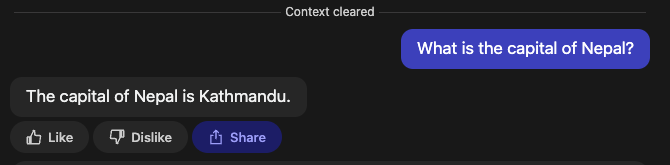

# Poe Bot Protocol

_Note: The Poe Protocol is not live yet. The protocol may still change and it is not yet
possible to create protocol-based bots._

[Poe](https://poe.com) is a platform for interacting with AI-based bots. That includes
well-known chat bots like OpenAI's ChatGPT and Anthropic's Claude, but anyone can create
their own bot by implementing the protocol described in this repository.

## Introduction

This specification provides a way to run custom bots from any web-accessible service
that can be used by the Poe app. Poe users will send requests to the Poe server, which
will in turn send requests to the bot server using this specification. As the bot server
responds, Poe will show the response to the user.

This specification consists of three sections:

- A “Terminology” section defining common terms
- A “Common topics” section outlining some concepts used throughout the specification
- A “Requests” section defining the request types that are part of the spec.

## Terminology

- _Poe server:_ server run by Poe that receives client requests, turns them into
  requests to bot servers, and streams the response back to the Poe client.
- _Bot server:_ server that provides an LLM response. Poe servers make a request to the
  bot servers and receive an LLM response.

## Common topics

### Versioning

It is expected that the API will be extended in the future to support additional
features. The protocol version string consists of two numbers (e.g., 1.0).

The first number is the _request version_. It will be incremented if the form the
request takes changes in an incompatible fashion. For example, the current protocol only
contains a single API call from Poe servers to bot servers. If we were to add another
API call that bot servers are expected to support, we would increment the request
version (e.g., from 1.0 to 2.0). This is expected to be very rare, and it will be
communicated to bot servers well in advance.

The second number is the _response version._ It will be incremented whenever the Poe
server adds support for a new feature that bot servers can use. For example, as of this
version we support two content types in LLM responses. If we were to add a third, we
would increment the response version (e.g., from 1.0 to 1.1). Bot servers written for an
earlier response version will continue to work; they simply will not use the new
feature.

The response version is also incremented for backward-compatible changes to the request.
For example, if we add a new field to the request body, we would increment the response
version. This is safe for old bot servers as they will simply ignore the added field.

Throughout the protocol, bot servers should ignore any dictionary keys without a
specified meaning. They may be used in a future version of the protocol.

### Identifiers

The protocol uses identifiers for certain request fields. These are labeled as
“identifier” in the specification. Identifiers are globally unique. They consist of a
sequence of 1 to 3 lowercase ASCII characters, followed by a hyphen, followed by 32
lowercase alphanumeric ASCII characters (i.e., they fulfill the regex
`^[a-z]{1,3}-[a-z0-9]{16}$`).

The characters before the hyphen are a tag that represents the type of the object. The
following types are currently in use:

- `m`: represents a message
- `u`: represents a user
- `c`: represents a conversation

### Authentication

When a user creates a bot, we assign a randomly generated token consisting of 32 ASCII
characters. To confirm that requests come from Poe servers, all requests will have an
Authorization HTTP header “Bearer \<token\>”, where \<token\> is the token. Bot servers
can use this to validate that requests come from real Poe servers.

### Context window

When we send a query request to the bot server, we send the previous messages in this
conversation, both from the user and from the bot. However, in some cases we truncate
the conservation. This is called the _context window_.

By default, there are two ways for the context window to reset:

- When the user clicks the icon in the app that resets context.
- When the user has not interacted with the bot for some time (around 1 hour, but the
  exact cutoff is subject to change).

The `settings` endpoint (see below) allows bot servers to control these two modes of
context clearing through the `allow_user_context_clear` and `context_clear_window_secs`
settings.

The context window can grow arbitrarily large if the bot’s settings disallow context
clearing, or simply if the user never manually clears their context and continually
talks to the bot.

### Content types

Messages may use the following content types:

- `text/plain`: Plain text, rendered without further processing
- `text/markdown`: Markdown text. Specifically, this supports all features of
  GitHub-Flavored Markdown (GFM, specified at https://github.github.com/gfm/). Poe may
  however modify the rendered Markdown for security or usability reasons. In particular,
  images are not yet supported.

### Limits

Poe may implement limits on bot servers to ensure the reliability and scalability of the
product. In particular:

- The initial response to any request must be returned within 5 seconds.
- The response to any request (including `query` requests) must be completed within 120
  seconds.
- The total length of a bot response (the sum of the length of all `text` events sent in
  response to a `query` request) may not exceed 10,000 characters.
- The total number of events sent in response to a `query` event may not exceed 1000.

We may raise these limits in the future if good use cases come up.

## Requests

The Poe server will send an HTTP POST request to the bot servers URL with content type
`application/json`. The body will be a JSON dictionary with the following keys:

- `version` (string): The API version that the server is using.
- `type` (string): This is one of the following strings:
  - `query`: Called when the user makes a query to the bot (i.e., they send a message).
  - `settings`: Query the bot for its desired settings.
  - `report_feedback`: Report to the bot server when certain events happen (e.g., the
    user likes a message).
  - `report_error`: Report to the bot server when an error happens that is attributable
    to the bot (e.g., it uses the protocol incorrectly).
  - Additional request types may be added in the future. Bot servers should ignore any
    request types they do not understand, ideally by sending a `501 Not Implemented`
    HTTP response.

Each of the request types is discussed in detail below.

### The `query` request type

In addition to the request fields that are valid for all queries, `query` requests take
the following parameters in the request:

- `query`: An array containing one or more dictionaries that represent a previous
  message in the conversation with the bot. These are in chronological order, the most
  recent message last. It includes all messages in the current context window (see
  above). These dictionaries contain the following keys:
  - `role` (string): one of the following strings:
    - `system`: A message that tells the bot how it should work. Example: “You are an AI
      assistant that gives useful information to Poe users.”
    - `user`: A message from the user. Example: “What is the capital of Nepal?"
    - `bot`: A response from the bot. Example: “The capital of Nepal is Kathmandu.”
    - More roles may be added in the future. Bot servers should ignore messages with
      roles they do not recognize.
  - `content` (string): The text of the message.
  - `content_type` (string): The content type of the message (see under “Content type”
    above). Bots should ignore messages with content types they do not understand.
  - `timestamp` (int): The time the message was sent, as the number of microseconds
    since the Unix epoch.
  - `message_id` (identifier with type m): Identifier for this message.
  - `feedback` (array): A list of dictionaries representing feedback that the user gave
    to the message. Each dictionary has the following keys:
    - `type` (string): Either `like` or `dislike`. More types may be added in the future
      and bot servers should ignore types they do not recognize.
    - `reason` (string): A string representing the reason for the action. This key may
      be omitted.
- `message_id` (identifier with type m): identifier for the message that the bot will
  create; also used for the `report_feedback` endpoint
- `user_id` (identifier with type `u`): the user making the request
- `conversation_id` (identifier with type `c`): identifier for the conversation the user
  is currently having. Resets when context is cleared.

The bot server should respond with an HTTP response code of 200. If any other response
code is returned, the Poe server will show an error message to the user. The server must
respond with a stream of server-sent events, as specified by the WhatWG
(https://html.spec.whatwg.org/multipage/server-sent-events.html).

Server-sent events contain a type and data. The Poe API supports several event types
with different meanings. For each type, the data is a JSON string as specified below.
The following event types are supported:

- `meta`: represents metadata about how the Poe server should treat the bot server
  response. This event should be the first event sent back by the bot server. If no
  `meta` event is given, the default values are used. If a `meta` event is not the first
  event, the behavior is unspecified; currently it is ignored but future extensions to
  the protocol may allow multiple `meta` events in one response. The data dictionary may
  have the following keys:
  - `content_type` (string, defaults to `text/markdown`): If this is `text/markdown`,
    the response is rendered as Markdown by the Poe client. If it is `text/plain`, the
    response is rendered as plain text. Other values are unsupported and are treated
    like `text/plain`.
  - `linkify` (boolean, defaults to false): If this is true, Poe will automatically add
    links to the response that generate additional queries to the bot server.
  - `suggested_replies` (boolean, defaults to false): If this is true, Poe will suggest
    followup messages to the user that they might want to send to the bot. If this is
    false, no suggested replies will be shown to the user. Note that the protocol also
    supports bots sending their own suggested replies (see below). If the bot server
    sends any `suggested_reply` event, Poe will not show any of its own suggested
    replies, only those suggested by the bot, regardless of the value of the
    `suggested_replies` setting.
  - `refetch_settings` (boolean, defaults to false): Setting this to true advises the
    Poe server that it should refetch the `settings` endpoint and update the settings
    for this bot. Bot servers should set this to true when they wish to change their
    settings. The Poe server may not refetch settings for every response with this field
    set; for example, it may refetch only once per hour or day.
- `text`: represents a piece of text to send to the user. This is a partial response;
  the text shown to the user when the request is complete will be a concatenation of the
  texts from all `text` events. The data dictionary may have the following keys:
  - `text` (string): A partial response to the user’s query
- `replace_response`: like `text`, but discards all previous `text` events. The user
  will no longer see the previous responses, and instead see only the text provided by
  this event. The data dictionary must have the following keys:
  - `text` (string): A partial response to the user's query
- `suggested_reply`: represents a suggested followup query that the user can send to
  reply to the bot’s query. The Poe UI may show these followups as buttons the user can
  press to immediately send a new query. The data dictionary has the following keys:
  - `text` (string): Text of the suggested reply.
- `error`: indicates that an error occurred in the bot server. If this event type is
  received, the server will close the connection and indicate to the user that there was
  an error communicating with the bot server. The server may retry the request. The data
  dictionary may contain the following keys:
  - `allow_retry` (boolean): If this is False, the server will not retry the request. If
    this is True or omitted, the server may retry the request.
  - `text` (string): A message indicating more details about the error. This message
    will not be shown to the user, but Poe will use it for internal diagnostic purposes.
    May be omitted.
- `done`: must be the last event in the stream, indicating that the bot response is
  finished. The server will close the connection after this event is received. The data
  for this event is currently ignored, but it must be valid JSON.

The bot response must include at least one `text` or `error` event; it is an error to
send no response.

If the Poe server receives an event type it does not recognize, it ignores the event.

### The `settings` request type

This request takes no additional request parameters other than the standard ones.

The server should respond with a response code of 200 and content type of
`application/json`. The JSON response should be a dictionary containing the keys listed
below. All keys are optional; if they are not specified the default values are used. Poe
reserves the right to change the defaults at any time, so if bots rely on a particular
setting, they should set it explicitly.

If a settings request fails (it does not return a 200 response code with a valid JSON
body), the previous settings are used for the bot. If this is the first request, that
means the default values are used for all settings; if it is a refetch request, the
settings previously used for the bot remain in use. If the request does not return a 2xx
or 501 response code, the Poe server may retry the settings request after some time.

The response may contain the following keys:

- `context_clear_window_secs` (integer or null): If the user does not talk to the bot
  for this many seconds, we clear the context and start a fresh conversation. Future
  `query` requests will use a new conversation identifier and will not include previous
  messages in the prompt. For example, suppose this parameter is set to 1800 (30 \* 60),
  and a user sends a message to a bot at 1 pm. If they then send another message at 1:20
  pm, the query send to the bot server will include the previous message and response,
  but if they send a third message at 2 pm, the query will include only the new message.
  If this parameter is set to 0, the context window is never cleared automatically,
  regardless of how long it has been since the user talked to the bot. If the parameter
  is omitted or `null`, the value will be determined by the Poe server.
- `allow_user_context_clear` (boolean): If true, allow users to directly clear their
  context window, meaning that their conversation with this bot will reset to a clean
  slate. This is independent from whether Poe itself will automatically clear context
  after a certain time (as controlled by `context_clear_window_secs`). The default is
  true.

### The `report_feedback` request type

This request takes the following additional parameters:

- `message_id` (identifier with type m): The message for which feedback is provided.
- `user_id` (identifier with type `u`): The user providing the feedback
- `conversation_id` (identifier with type `c`): The conversation giving rise to the
  feedback
- `feedback_type` (string): May be `like` or `dislike`. Additional types may be added in
  the future; bot servers should ignore feedback with types they do not recognize.

The server’s response is ignored.

### The `report_error` request type

When the bot server fails to use the protocol correctly (e.g., when it uses the wrong
types in response to a `settings` request, the Poe server may make a `report_error`
request to the server that reports what went wrong. The protocol does not guarantee that
the endpoint will be called for every error; it is merely intended as a convenience to
help bot server developers debug their bot.

This request takes the following additional parameters:

- `message` (string): A string describing the error.
- `metadata` (dictionary): May contain metadata that may be helpful in diagnosing the
  error, such as the conversation_id for the conversation. The exact contents of the
  dictionary are not specified and may change at any time.

The server’s response is ignored.

## Example



Suppose we’re having the above conversation over Poe with a bot server running at
`https://ai.example.com/llm`.

For the Poe conversation above, the Poe server sends a POST request to
`https://ai.example.com/llm` with the following JSON in the body:

```
{
    "version": "1.0",
    "type": "query",
    "query": [
        {
            "role": "user",
            "content": "What is the capital of Nepal?",
            "content_type": "text/markdown",
            "timestamp": 1678299819427621,
        }
    ],
    "user": "u-1234abcd5678efgh",
    "conversation": "c-jklm9012nopq3456",
}
```

The provider responds with an HTTP 200 response code, then sends the following
server-sent events:

```
event: meta
data: {"content_type": "text/markdown", "linkify": true}

event: text
data: {"text": "The"}

event: text
data: {"text": " capital of Nepal is"}

event: text
data: {"text": " Kathmandu."}

event: done
data: {}
```

The text may also be split into more or fewer individual events as desired. Sending more
events means that users will see partial responses from the bot server faster.

## Where to go from here?

- Quick Start: Please checkout our
  [API Bots tutorial](https://github.com/poe-platform/api-bot-tutorial) which includes
  starter code and instructions to help you get your bot running.
- Example implementations
  - [HerokuCat](https://poe.com/HerokuCat), a demo bot to demonstrate the features of
    the protocol. See the
    [documentation](https://github.com/poe-platform/poe-protocol/blob/main/docs/catbot.md)
    for a full list of commands supported.
    - The source code for this bot is available in the
      [tutorial](https://github.com/poe-platform/api-bot-tutorial/blob/main/catbot.py).
  - [FastAPI](./fastapi_poe/), a simple bot to demonstrate the features of the protocol
  - [aiohttp](./aiohttp_poe/), the same bot built using aiohttp instead of FastAPI
  - [LangChain](./langchain_poe/), an example bot built on top of ChatGPT using
    [LangChain](https://github.com/hwchase17/langchain)
  - [LlamaIndex](./llama_poe/), a knowledge-augmented Poe bot powered by
    [LlamaIndex](https://gpt-index.readthedocs.io/en/latest/) and FastAPI.
  - [Poe Simulator](./simulator_poe/), a simulated Poe server for testing your bot

## Questions?

Join us on [Discord](https://discord.gg/TKxT6kBpgm) with any questions.
