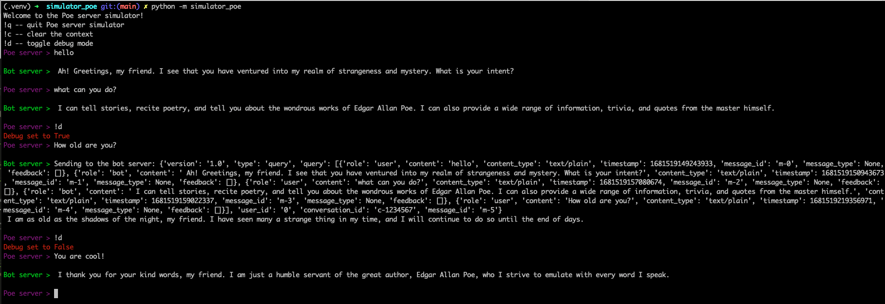

# Poe Server Simulator

A Poe Server simulator has been developed to simplify the process of locally testing
your bot server. Please note that this simulator is intended for testing purposes only,
and there may be variations from the actual Poe server. Therefore, it is still crucial
to thoroughly test your bot server before its release.

## Getting Started

To use the Poe server simulator, follow these steps:

- Clone this repository and navigate to the directory.
- Install the server by running the command `pip install .`.
- Start the simulator by running `python3 -m simulator_poe`
- By default, the simulator communicates with a bot server that listens on
  `127.0.0.1:8080`. If you want to use a different bot server, run the command
  `BOT_SERVER=<Your Bot Server> python3 -m simulator_poe`
- You can now begin chatting with your bot server using the simulator!

## Limitations

- The Poe server only processes query messages
- It always prints the text as plain text
- The user ID and conversation ID remain fixed.
